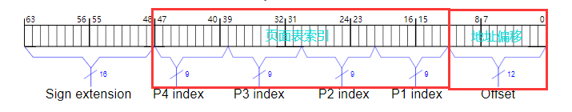
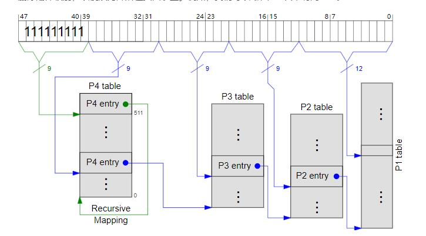

## 分页模块


x86体系结构下的地址，64位模式下使用4级页表。地址位有48位，高16位为符号扩展位。



### 基本分页模块 /paging/mod.rs
```
/// Number of entries per page table
pub const ENTRY_COUNT: usize = 512;

/// Size of pages
pub const PAGE_SIZE: usize = 4096;

/// A physical address
pub struct PhysicalAddress(usize);

/// A virtual address.
pub struct VirtualAddress(usize);
```
定义每个表的条目数和页表大小4KB 

### 页表条目 /paging/entry.rs
该模块包括对物理地址和各种标志位的设置和定义
详细见paging_first.md

### 页表 /paging/table.rs
```
pub struct Table {
    entries: [Entry; ENTRY_COUNT],
}
```
包含一个512页表条目的数组

添加函数Index便于索引本身
```
impl<L> Index<usize> for Table<L> where L: TableLevel {
    type Output = Entry;

    fn index(&self, index: usize) -> &Entry {
        unsafe { &self.entries[index] }//取出索引为index下的条目
    }
}
```
页表的映射方法
代码中采用的是递归映射的方式
设置的关键方法：P4的最后一个条目不指向 P3 表，而是指向 P4 表本身。我们可以使用此条目直接索引在页面表上。
例如："循环"一次来访问 P1 表
选择指向 P4 表本身的第 511 个 P4 条目，P4 表用作 P3 表。同样，P3 表用作 P2 表，P2 表被视为 P1 表。因此，P1 表将成为目标页，可以通过偏移量访问。



实现
|表|地址||
|---|---|---|
|P4|0o177777_777_777_777_777_0000|-|
|P3|0o177777_777_777_777_XXX_0000|XXX是 P4 索引|
|P2|0o177777_777_777_XXX_YYY_0000|YYY是 P3的索引|
|P1|0o177777_777_XXX_YYY_ZZZ_0000|ZZZ是 P3的索引|

P2的地址就是可以通过P3的地址变化得到，即(P3<<9) | (YYY<<12)

根据这个公式可以得到下一页表的地址计算的方法
```
 fn next_table_address(&self, index: usize) -> Option<usize> {
        let entry_flags = self[index].flags();//取出对应的标志位
        if entry_flags.contains(EntryFlags::PRESENT) && !entry_flags.contains(EntryFlags::HUGE_PAGE) {
            //存在相应条目且是页大小为4KB 
            let table_address = self as *const _ as usize;
            Some((table_address << 9) | (index << 12))//构造下一级索引的地址
        } else {
            None
        }
    }
```
### 映射和翻译 /paging/mapper.rs
```
/// Translate a virtual address to a physical one
    //将虚拟地址翻译成物理地址
    pub fn translate(&self, virtual_address: VirtualAddress) -> Option<PhysicalAddress> {
        let offset = virtual_address.get() % PAGE_SIZE;//起始地址%页大小
        self.translate_page(Page::containing_address(virtual_address))
            .map(|frame| PhysicalAddress::new(frame.start_address().get() + offset))
        //containing_address在mod.rs模块中
        //translate_page在mapper.rs模块中
    }

```


containing_address方法
```
pub fn containing_address(address: VirtualAddress) -> Page {
    assert!(address < 0x0000_8000_0000_0000 ||
        address >= 0xffff_8000_0000_0000,
        "invalid address: 0x{:x}", address);
    Page { number: address / PAGE_SIZE }
}
```

translate_page方法
```
 pub fn translate_page(&self, page: Page) -> Option<Frame> {//翻译地址
        self.p4().next_table(page.p4_index())
            .and_then(|p3| p3.next_table(page.p3_index()))
            .and_then(|p2| p2.next_table(page.p2_index()))
            .and_then(|p1| p1[page.p1_index()].pointed_frame())
        //实现逻辑：p4索引存在的前提下，如果p3地址有效，索引找到p3的下一级页表
        //                            如果p2地址有效，索引找到p2的下一级页表
        //                            如果p1地址有效，索引找到对应的物理帧
        //pointed_frane函数是通过entry_flags中的present位来进行判断的
        //pub fn pointed_frame(&self) -> Option<Frame> {
        //     if self.flags().contains(EntryFlags::PRESENT) {//检测present是否在EntryFlags中
        //         Some(Frame::containing_address(self.address()))//创建帧
        //     } else {
        //         None
        //     }
        // }
    }
```

返回地址索引的方法
```
fn p4_index(&self) -> usize {
    (self.number >> 27) & 0o777
}
fn p3_index(&self) -> usize {
    (self.number >> 18) & 0o777
}
fn p2_index(&self) -> usize {
    (self.number >> 9) & 0o777
}
fn p1_index(&self) -> usize {
    (self.number >> 0) & 0o777
}
```
建立页到帧的映射关系
```
 pub fn map_to(&mut self, page: Page, frame: Frame, flags: EntryFlags) -> MapperFlush {
        let p3 = self.p4_mut().next_table_create(page.p4_index());
        let p2 = p3.next_table_create(page.p3_index());
        let p1 = p2.next_table_create(page.p2_index());

        assert!(p1[page.p1_index()].is_unused(),
            "{:X}: Set to {:X}: {:?}, requesting {:X}: {:?}",
            page.start_address().get(),
            p1[page.p1_index()].address().get(), p1[page.p1_index()].flags(),
            frame.start_address().get(), flags);
        p1.increment_entry_count();//增加页表条目数量
        p1[page.p1_index()].set(frame, flags | EntryFlags::PRESENT);//设置present位，不设置对于映射页面没有意义
        MapperFlush::new(page)
    }
```
找到一个空闲帧，为其建立其映射关系
```
 pub fn map(&mut self, page: Page, flags: EntryFlags) -> MapperFlush {
        let frame = allocate_frames(1).expect("out of frames");//分配一个空闲帧
        self.map_to(page, frame, flags)//为page和frame建立映射关系
    }
```

### 临时映射 /paging/tempoary_page.rs


```
// src/memory/paging/mod.rs
mod temporary_page;

// src/memory/paging/temporary_page.rs

use super::Page;

pub struct TemporaryPage {
    page: Page,
}
```
添加方法去实现临时映射，并且不映射页


添加一个函数来修改非活动页面表。通过该函数，我们将创建一个新的页面表层次结构，该层次结构使用 4KiB 页面正确映射内核。然后，我们将切换到新表以获得更安全的内核环境。

- 实现目标：使用函数在新的页面表中正确映射内核部分
- 非活动页表：和活动页表的区别在于是否被CPU使用
- 添加临时页表结构-->keep the paging module clean

为临时页表添加映射map和解除映射unmap的方法

创建有效的非活动页表，这些表被归零并递归映射。但是我们仍然无法修改它们。要解决此问题，我们需要再次查看递归映射。
重新访问递归映射
递归映射的工作原理是将最后一个 P4 条目映射到 P4 表本身。因此，我们可以通过循环一次或多次来访问页表。
可以使用相同的机制来访问非活动表。诀窍是更改活动 P4 表的递归映射以指向非活动 P4 表


现在，可以完全像活动表一样访问非活动表，即使是神奇的地址也是一样的。这允许我们使用接口和现有的映射方法为非活动表， 太.请注意，除了递归映射之外，其他所有内容都继续完全像以前一样工作，因为我们从来没有更改过 CPU 中的活动表。
